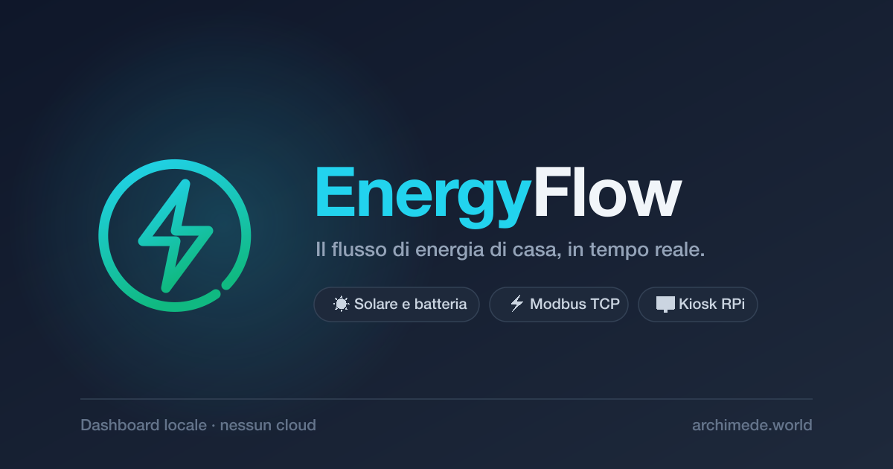
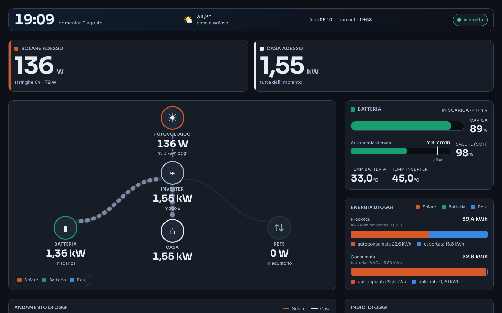
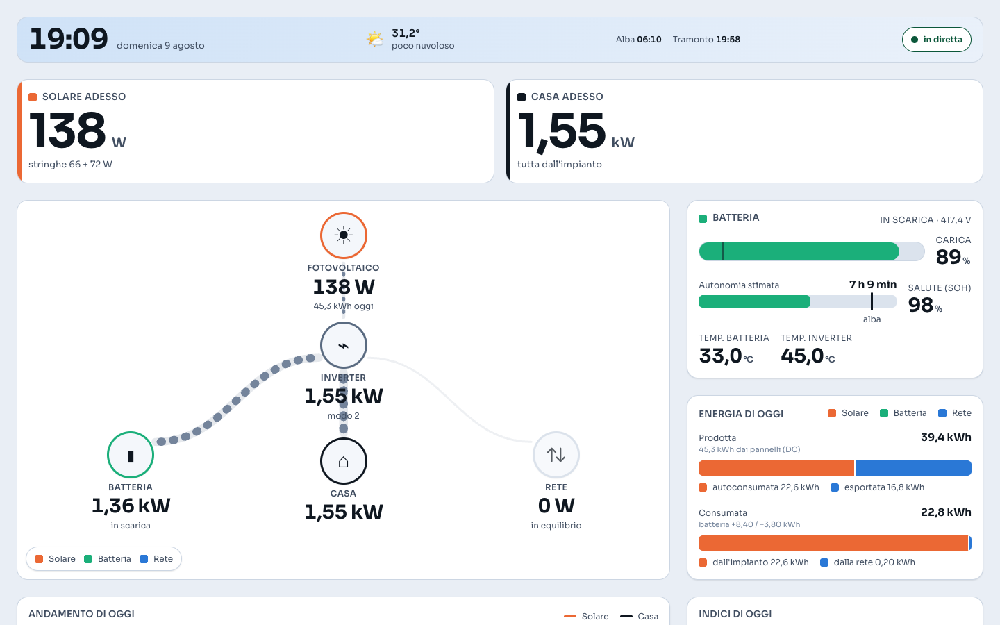
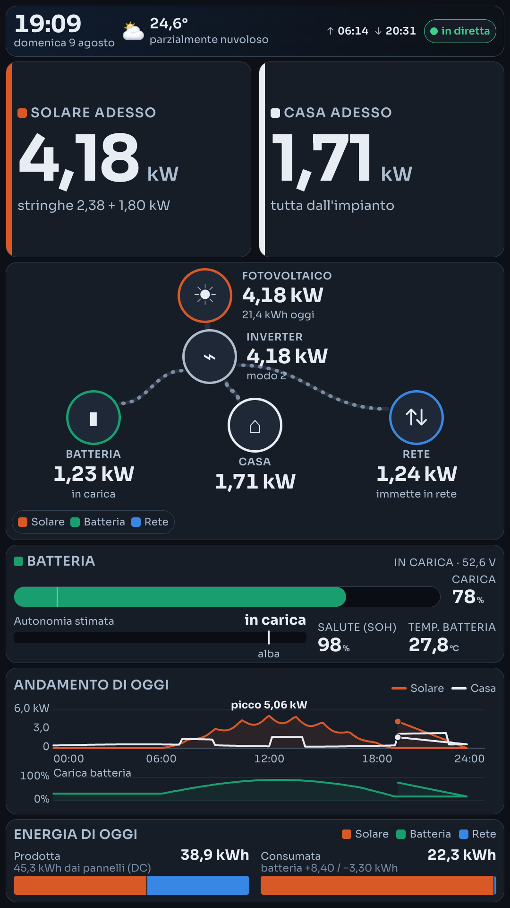
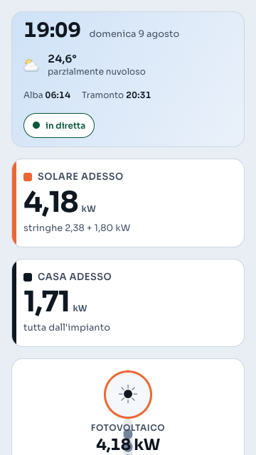
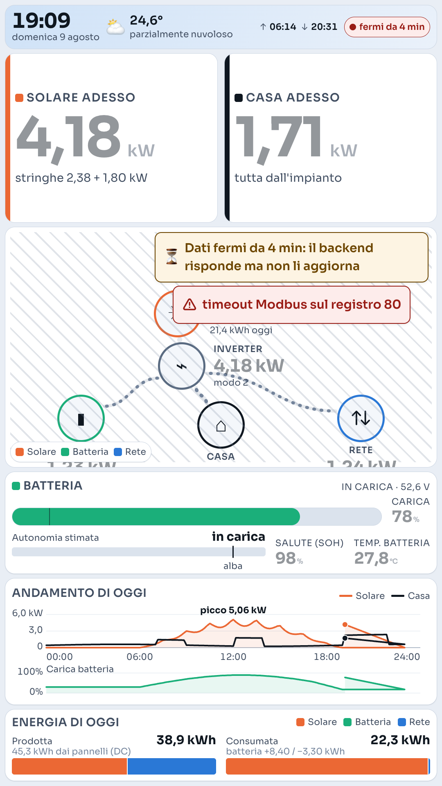
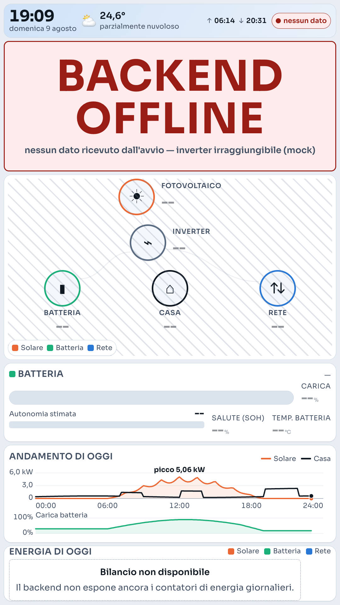
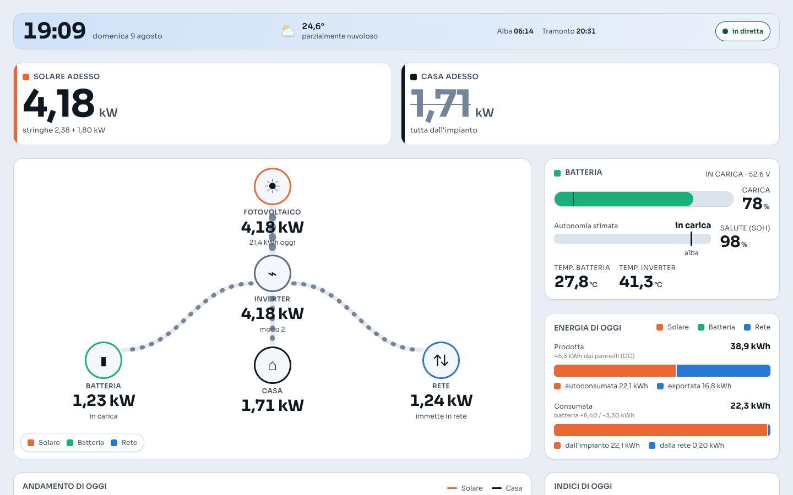

<p align="center">
  
</p>

<h1 align="center">EnergyFlow</h1>

<p align="center">
  Your home's energy flow in real time, read straight from the inverter<br>
  over Modbus TCP — no vendor cloud in the loop.
</p>

<p align="center">
  <a href="https://archimede.world">archimede.world</a>
</p>

<p align="center">
  <a href="README.md">IT</a> · <b>EN</b>
</p>

---

## Overview

EnergyFlow reads the solar inverter's registers over the local network, decodes them
with a versioned register map **validated against the manufacturer's own portal**, and
publishes the result on a local, authenticated HTTP API.

Three consumers feed off that API: the **web dashboard** (desktop and mobile), the
**wall panel** running as a vertical kiosk on a Raspberry Pi, and the **native macOS
widgets**.

Data arrives with the polling latency — 5 seconds — instead of the portal's minutes, and
never leaves the home network: the server listens on `127.0.0.1`, and remote access goes
through a private tailnet rather than an open port on the internet.

The device identifies itself in its own registers: **SolaX X1‑Hybrid G4** single‑phase
(the Q.CELLS Q.HOME ESS HYB‑G3 is a rebrand of it).

## Features

**Data correctness**
- `registers.json` **v2.1**: 69 fields, 48 published, **21 declared `unknown` and
  excluded from the API** rather than guessed.
- Cross‑checked against the official portal with 3 time‑paired samples and **two
  arithmetic identities** that pin down scales and word order together.
- **12 physical invariants** (`--validate`): energy balance, efficiency, V×I=P, cell
  count, power integral versus meter counter, counter monotonicity, midnight reset,
  zero night production, plus the portal's daily and lifetime identities.
- Always‑on watchdog: a value outside its physical domain becomes `quality: suspect` and
  drives `/health` to `degraded` (503) within one poll.

**Robustness**
- The Modbus poller runs in its own thread: the API always serves from cache and
  **never blocks** when the inverter is slow or missing.
- **Auto‑discovery**: after 5 failed polls it sweeps the local subnet on port 502,
  recognises the inverter by its register signature, and re‑attaches on its own when
  DHCP hands it a new address.
- **systemd** service with `Restart=always`, enabled at boot.

**Interface**
- Flow diagram whose arcs are **measured from the real nodes**
  (`getBoundingClientRect`), with no hardcoded coordinates: it holds at any aspect ratio.
- **Day/night adaptive theme** tied to actual sunrise and sunset, with a persisted
  manual override. Contrast ratios **verified by computation at AAA level**.
- **Two layouts from a single markup**: 1080×1920 vertical kiosk and a compact
  mobile/desktop view.
- Honest states: loading with **no fake numbers**, `stale` and `offline` kept distinct
  (they are two different failures), `suspect` fields struck through.
- Daily chart, energy balance, estimated battery runtime to sunrise, weather and solar
  times.

**Security**
- Bound to `127.0.0.1`, bearer token generated into `.env` (mode 600), `HttpOnly;
  SameSite=Strict` cookie, explicit static‑file allow‑list, **strict CSP with no CDN and
  no inline**, no wildcard CORS, inverter serial masked in the API.

## Installation and startup

### Prerequisites

```bash
python3 --version        # 3.9+
pip install pymodbus     # v3.8 and v3.11+ are both supported
```

### Setup

```bash
git clone https://github.com/ripu/EnergyFlow.git
cd EnergyFlow
cp config.example.json config.json
```

Fill in `config.json` with your own values — coordinates, the inverter's LAN address,
battery capacity, server port:

```jsonc
{
  "location": { "latitude": 0.0, "longitude": 0.0, "timezone": "Europe/Rome" },
  "inverter": { "ip": "<inverter-lan-ip>", "port": 502 },
  "battery":  { "capacity_kwh": 0.0, "min_soc": 0 },
  "server":   { "port": 8003 }
}
```

`config.json` and `.env` are gitignored and never reach the repository.

### Run

```bash
python3 invert.py --serve            # port from config.json (default 8003)
python3 invert.py                    # one-shot terminal read, no server
python3 invert.py --print-token      # print the access token
python3 invert.py --validate --duration 600
```

Then open `http://127.0.0.1:8003/`. On first start the token is generated into `.env`
with mode `600`; the browser receives it as an `HttpOnly` cookie when it loads the page,
non‑browser clients read it from `$ENERGYFLOW_TOKEN` or `~/.config/energyflow/token`.

If the port is taken **the server refuses to start** and names the process holding it —
it never moves to another port silently.

### Raspberry Pi service

```bash
sudo cp energyflow.service /etc/systemd/system/
sudo systemctl daemon-reload
sudo systemctl enable --now energyflow
systemctl status energyflow
```

For the wall panel, copy `deploy/labwc-autostart` to `~/.config/labwc/autostart`: it
rotates the display by 270° and launches chromium in kiosk mode on
`http://localhost:8003/`.

For remote access without opening any port to the internet:

```bash
sudo tailscale serve --bg http://127.0.0.1:8003
```

## Tech stack

| Layer | Technology |
|---|---|
| Backend | Python 3 (`http.server` / `ThreadingHTTPServer`), no framework |
| Protocol | Modbus TCP via `pymodbus` (input registers, function code 4) |
| Frontend | HTML5, CSS3, classic JavaScript — **no build step, no ES modules** |
| Font | Sora variable, self‑hosted (~25 KB) |
| Weather | Open‑Meteo, through a server‑side proxy |
| Deployment | systemd on Raspberry Pi, labwc/Wayland kiosk + chromium |
| Remote access | Tailscale (`tailscale serve`, HTTPS, tailnet‑only) |
| Native clients | Swift (`macos-widget/`) |

## Keyboard shortcuts

| Key | Action |
|---|---|
| `?` | Open and close the help panel |
| `r` | Refresh data now |
| `a` | Auto‑refresh on/off |
| `t` | Theme: automatic → light → dark → automatic |
| `k` | Kiosk / compact mode |
| `1` | Flow view |
| `2` | History view |
| `3` | Technical view |
| `d` | Register panel |
| `f` | Fullscreen |
| `Esc` | Close the overlay |

Keys stay inert while you are typing into a text field.

## Logs and debugging

- **Daily logs** in `log/YYYY-MM-DD.txt` (gitignored: they stay on the machine).
- **Browser logs land in the same file**: `logger.js` intercepts
  `console.log/warn/error` plus uncaught errors and ships them to `POST /log`, which
  writes them with a `[BROWSER:LEVEL]` prefix. The wall panel has no reachable console,
  so this is the only way to see what happened there.
- **Timing on every poll**: duration in milliseconds, source, summary values and failing
  invariants, all on one line.
- Under systemd: `journalctl -u energyflow -f` (`PYTHONUNBUFFERED=1` removes the
  buffering delay).
- **`/health`** is a real probe, not a ping: `200` when the poller is fresh and no
  invariant persists in failure, `503 degraded` otherwise, with the list of problems.

```bash
curl -s http://127.0.0.1:8003/health | python3 -m json.tool
python3 invert.py --serve --debug        # dump non-zero registers on every poll
```

## Documentation

The full system state — register map, API contract, sign convention, security,
deployment, go‑live — lives in **[`SODE.md`](SODE.md)** (Italian).

The *sign convention* section is worth reading on its own: it explains why
`grid_flow_w` carries the opposite sign to the register it comes from, and why home load
is computed from the **signed** AC power.

## Screenshots

**Desktop, dark and light themes**




**1080×1920 vertical kiosk — the wall panel**



**Mobile, 360 px**



**Failure states** — stale data, unreachable backend, suspect field






## License

MIT — see [LICENSE](LICENSE).
