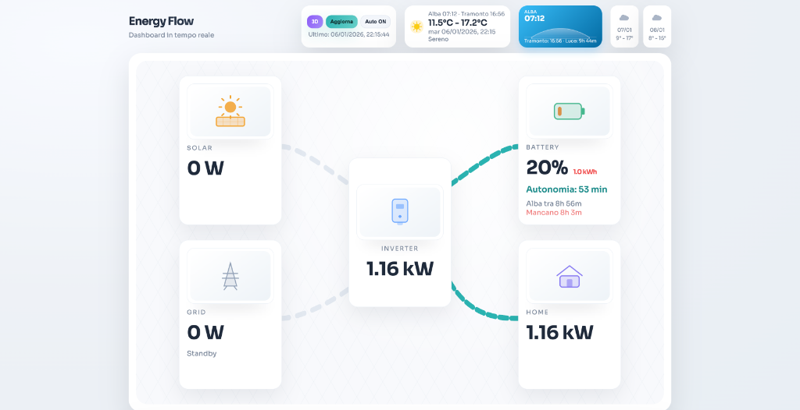

# ⚡ Real-Time Inverter Dashboard

Dashboard in tempo reale per monitorare il mio impianto fotovoltaico domestico con visualizzazione dei flussi energetici, calcolo automatico dell'autonomia della batteria e previsioni meteo integrate.


## 🎯 Motivazione

Ho creato questo progetto perché volevo **vedere in tempo reale** cosa stesse facendo il mio impianto fotovoltaico:
- 📊 **Monitoraggio istantaneo** di produzione solare, consumo domestico e stato della batteria
- 🔋 **Calcolo rapido dell'autonomia**: quanto durano le batterie fino all'alba?
- ☀️ **Previsioni intelligenti**: il mio sistema coprirà tutta la notte senza dover prelevare dalla rete?
- 🌐 **Visualizzazione intuitiva** dei flussi energetici tra pannelli, inverter, batteria, casa e rete

## ✨ Caratteristiche Principali

### 📈 Monitoraggio Real-Time
- **Produzione solare** in tempo reale (W/kW)
- **Stato batteria** con percentuale e kWh disponibili
- **Consumo domestico** istantaneo
- **Scambio con la rete** (import/export)
- **Potenza inverter** e tensione di rete

### 🔋 Calcolo Autonomia Intelligente
- Stima runtime batteria basata sul carico attuale
- Calcolo automatico del tempo mancante all'alba
- Indicatore visivo: "Copre fino all'alba" o deficit energetico
- Batteria visiva con gradiente di colore (verde→giallo→rosso)

### 🌤️ Integrazione Meteo
- Previsioni meteo da Open-Meteo (temperatura, condizioni, icone)
- **Sun tracker visivo** stile iOS con arco solare animato
- Calcolo durata del giorno (ore di luce solare)
- Forecast a 2 giorni con icone meteo

### 🎨 Visualizzazione Dati
- **Vista 2D**: Flow diagram con linee animate SVG che mostrano i flussi energetici
- **Vista 3D**: Rappresentazione isometrica dell'impianto (Three.js)
- Nodi uniformi con icone moderne e pulite
- Animazioni fluide per tutte le transizioni

## 🛠️ Tech Stack

- **Frontend**: HTML5, CSS3, Vanilla JavaScript
- **3D Graphics**: Three.js
- **Backend**: Python 3 (`http.server`)
- **Protocollo**: Modbus TCP (via `pymodbus`)
- **Weather API**: [Open-Meteo](https://open-meteo.com)
- **Inverter**: Compatibile con registri Modbus standard

## 📦 Installazione

### Prerequisiti
```bash
# Python 3.7+
python3 --version

# Installare pymodbus
pip install pymodbus
```

### Setup
1. **Clona il repository**
   ```bash
   git clone https://github.com/ripu/realtime-inverter.git
   cd realtime-inverter
   ```

2. **Configura le tue impostazioni**
   ```bash
   cp config.example.json config.json
   # Modifica config.json con i tuoi dati (GPS, IP inverter, capacità batteria)
   ```

3. **Personalizza il mapping Modbus** (opzionale)
   
   Modifica `registers.json` solo se il tuo inverter usa registri diversi:
   ```json
   {
     "grid_voltage": 0,
     "inverter_power": 2,
     "grid_power": 3,
     "battery_percent": 28
   }
   ```

4. **Avvia il server backend**
   ```bash
   python3 invert.py --serve --port 8003
   ```

5. **Apri il browser**
   ```
   http://localhost:8003
   ```

## ⚙️ Configurazione

### Prima Configurazione

1. **Copia il file di esempio**
   ```bash
   cp config.example.json config.json
   ```

2. **Modifica `config.json` con i tuoi dati**
   ```json
   {
     "location": {
       "latitude": 37.003794,    // Le tue coordinate GPS
       "longitude": 15.255515,
       "timezone": "Europe/Rome"
     },
     "inverter": {
       "ip": "192.168.1.124",    // IP del tuo inverter
       "port": 502
     },
     "battery": {
       "capacity_kwh": 5.12      // Capacità della tua batteria in kWh
     },
     "server": {
       "port": 8003
     }
   }
   ```

3. **Personalizza il mapping Modbus**
   
   Modifica `registers.json` con i registri specifici del tuo inverter:
   ```json
   {
     "grid_voltage": 0,
     "inverter_power": 2,
     "grid_power": 3,
     "battery_percent": 28,
     "pv1_voltage": 70,
     "pv1_current": 71
   }
   ```

> **Nota**: Il file `config.json` è escluso da Git (vedi `.gitignore`), quindi le tue informazioni personali rimangono private.

## 📊 Funzionalità Avanzate

### Auto-Refresh
- **Auto ON/OFF**: Polling automatico ogni 3 secondi
- **Pull manuale**: Aggiorna i dati on-demand
- Timestamp ultimo aggiornamento sempre visibile

### Filtri Intelligenti
- Valori di rete < 50W vengono azzerati (riduce rumore)
- Gestione errori Modbus con fallback a dati di esempio

### Sunrise/Sunset Logic
- Calcolo preciso del prossimo evento solare
- Adattamento automatico giorno/notte
- Visualizzazione dinamica del punto solare sull'arco

## 🎨 Personalizzazione

### Colori Tema
Modifica le variabili CSS nel `<style>`:
```css
--bg: #f4f6fa;
--panel: #ffffff;
--accent: #0ea5e9;
--danger: #ef4444;
```

### Icone Nodi
Tutte le icone SVG sono inline e personalizzabili. Cerca `viewBox="0 0 70 60"` nel codice.

## 📸 Screenshot



*Dashboard in tempo reale che mostra produzione solare, stato batteria, consumo domestico e flussi energetici animati*

## 🚀 Roadmap

- [ ] Grafici storici per produzione/consumo
- [ ] Notifiche push per eventi critici
- [ ] Export dati CSV
- [ ] App mobile companion

## 🤝 Contributi

Contributi, issue e richieste di funzionalità sono benvenuti!

## 📄 Licenza

MIT License - Vedi [LICENSE](LICENSE) per dettagli

## 👤 Autore

**Ripu**
- 📍 Siracusa, Italia
- ⚡ Impianto: Fotovoltaico + Batteria di accumulo

---

⭐ Se questo progetto ti è utile, lascia una stella su GitHub!
