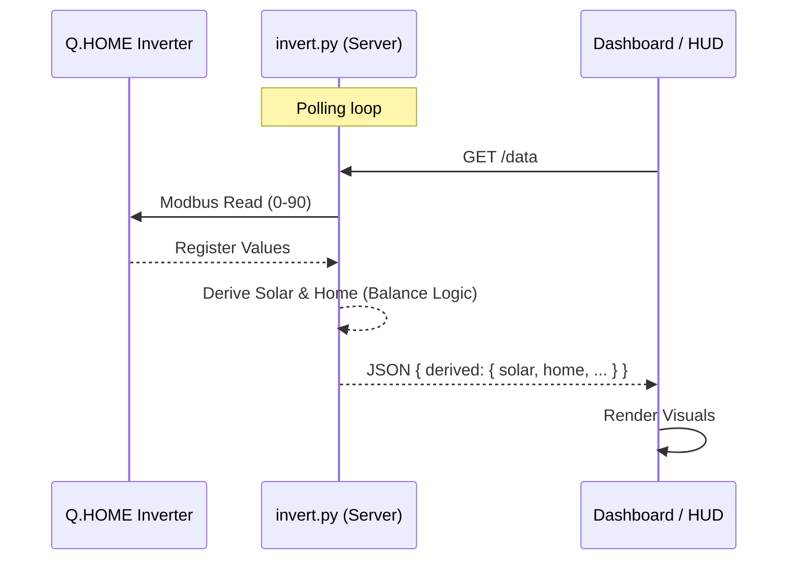

# SODE: Realtime Inverter System

> **System Overview & Development Environment**
> *Live monitoring of photovoltaic energy flow via Modbus & Web Dashboard.*

## 1. Project Overview
**Realtime Inverter** is a lightweight solution to read energy data from a Q.HOME (or compatible) inverter via Modbus TCP and visualize it on a real-time responsive dashboard.
The system bypasses cloud delays by connecting directly to the inverter's local interface.

### Key Features
- **Direct Modbus TCP Integation**: Reads registers directly from the device (default IP: `192.168.X.XXX`).
- **Web API**: Exposes data via a local HTTP JSON endpoint.
- **Visual Dashboard**: **Star Topology** visualization (Inverter Centric) with real-time energy flow animations.
- **macOS HUD**: Native Menu Bar app (`EnergyBar`) for always-visible monitoring.

## 2. Actors & Components

### 2.1 Backend (`invert.py`)
- **Role**: Modbus Master & API Server.
- **Dependencies**: `pymodbus`.
- **Logic**:
    - **Solar**: Derived from balance (`Home + Battery - Grid`).
    - **Home**: Calculated as `Inverter Power + Grid Flow`.
    - **Grid**: Inverted logic (Negative = Export).
- **Functions**:
    - `read_registers()`: Polls 90+ registers.
    - `serve()`: Runs `HTTPServer` (default port 8003).

### 2.2 Frontend (`index.html`)
- **Role**: Client UI Dashboard.
- **Topology**: **Star** (Inverter in center).
- **Battery**: Configured for **12 kWh** capacity.
- **Visuals**: Animated dashed lines indicating flow direction.

### 2.3 macOS HUD (`EnergyBar.app`)
- **Role**: Status Bar Widget.
- **Source**: Polls `http://localhost:8003/data`.
- **Layout**: Grid → Home → Solar → Battery.
- **Format**: Compact 1-decimal precision (e.g. `2.8kW`).

## 3. Architecture & Data Flow



## 4. Configuration & Procedures

### 4.1 Prerequisites
- Python 3.x
- `pip install pymodbus`
- Swift (for HUD compilation)

### 4.2 Running the Backend
```bash
# Start server (default port 8003)
python3 invert.py --serve --port 8003
```

## 5. Data Dictionary (Key Registers)

| Register | Name | Unit | Notes |
|----------|------|------|-------|
| 2 | Inverter Power | W | Total AC Generation |
| 22 | Battery Power | W | + Charge / - Discharge |
| 28 | Battery SOC | % | 12kWh Capacity |
| 80 | Grid Flow | W | Priority Reg (Pos=Export raw) |
| 70-75 | PV Raw | V/A | *Unreliable/Ignored* (Solar is Derived) |

## 6. Repository & Versioning
- **Repo**: `ripu/energyflow`
- **Branching**: `main` as stable.
- **Commit Policy**: All changes must be tested locally before push. Update SODE on architectural changes.
