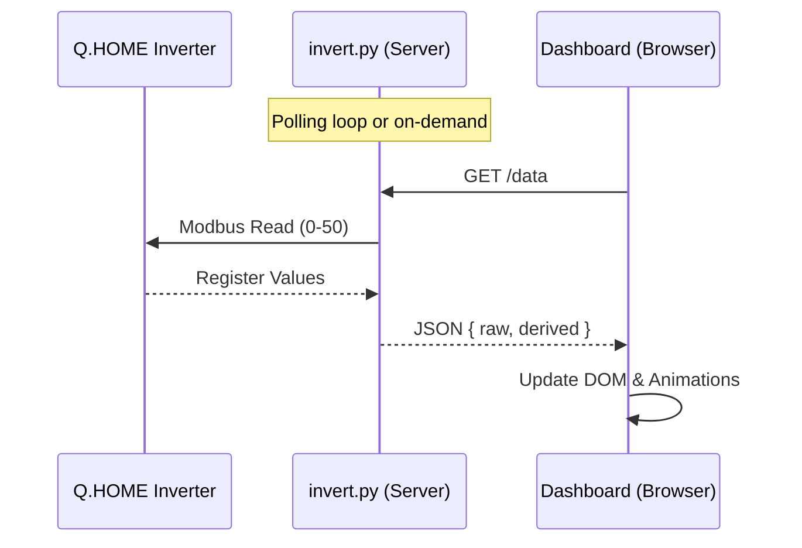

# SODE: Realtime Inverter System

> **System Overview & Development Environment**
> *Live monitoring of photovoltaic energy flow via Modbus & Web Dashboard.*

## 1. Project Overview
**Realtime Inverter** is a lightweight solution to read energy data from a Q.HOME (or compatible) inverter via Modbus TCP and visualize it on a real-time responsive dashboard.
The system bypasses cloud delays by connecting directly to the inverter's local interface.

### Key Features
- **Direct Modbus TCP Integation**: Reads registers directly from the device (default IP: `192.168.1.124`).
- **Web API**: Exposes data via a local HTTP JSON endpoint.
- **Visual Dashboard**: A "flow-style" visualization of energy moving between Solar, Battery, Home, and Grid.
- **Weather Integration**: Placeholder UI for weather data (needs integration).

## 2. Actors & Components

### 2.1 Backend (`invert.py`)
- **Role**: Modbus Master & API Server.
- **Dependencies**: `pymodbus`.
- **Functions**:
    - `read_registers()`: Polls 50+ registers from the inverter.
    - `serve()`: Runs a `HTTPServer` on port 8000.
    - `decode_values()`: Converts raw 16-bit registers into human-readable floats (Volts, Watts, %).

### 2.2 Frontend (`index.html`)
- **Role**: Client UI.
- **Tech Stack**: Vanilla HTML5, CSS3 (Variables + Grid), Vanilla JS.
- **Functions**:
    - Polls `http://localhost:8000/data` every 5 seconds.
    - Animates energy flows (dots moving through lines).
    - Visualizes state (Battery %, Grid import/export, Solar generation).

## 3. Architecture & Data Flow



## 4. Configuration & Procedures

### 4.1 Prerequisites
- Python 3.x
- `pip install pymodbus`

### 4.2 Running the Backend
```bash
# Start server on 0.0.0.0:8000
python3 invert.py --serve

# Options
# --host [IP]
# --port [PORT]
# --count [N] (default 50)
```

### 4.3 Running the Frontend
- Open `index.html` in any modern web browser.
- Ensure the API is reachable at `http://localhost:8000` (or configure `window.API_URL` if different).

## 5. Data Dictionary (Key Registers)

| Register | Name | Unit | Notes |
|----------|------|------|-------|
| 0 | Grid Voltage | 0.1 V | |
| 2 | Inverter Power | W | Signed (Gen/Cons) |
| 21 | Grid Flow | W | + Import / - Export |
| 28 | Battery SOC | % | |
| 33 | Battery Voltage | 0.1 V | |

## 6. Repository & Versioning
- **Repo**: `ripu/realtime-inverter` (GitHub Private)
- **Branching**: `main` as stable.
- **Commit Policy**: All changes must be tested locally before push. Update SODE on architectural changes.
