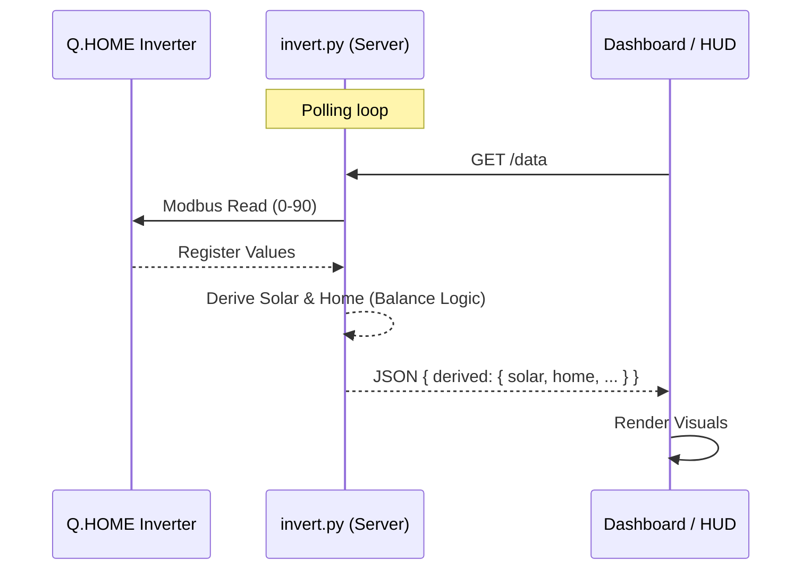

# SODE: Realtime Inverter System

> **System Overview & Development Environment**
> *Live monitoring of photovoltaic energy flow via Modbus & Web Dashboard.*

## 1. Project Overview


**Realtime Inverter** is a lightweight solution to read energy data from a Q.HOME (or compatible) inverter via Modbus TCP and visualize it on a real-time responsive dashboard.
The system bypasses cloud delays by connecting directly to the inverter's local interface.

### Key Features
- **Direct Modbus TCP Integation**: Reads registers directly from the device (default IP: `192.168.X.XXX`).
- **Web API**: Exposes data via a local HTTP JSON endpoint.
- **Visual Dashboard**: **Star Topology** visualization (Inverter Centric) with real-time energy flow animations.
- **macOS HUD**: Native Menu Bar app (`EnergyBar`) for always-visible monitoring.

## 2. Actors & Components

### 2.1 Backend (`invert.py`)
- **Role**: Modbus Master & API Server.
- **Dependencies**: `pymodbus`.
- **Logic**:
    - **Solar**: Derived from balance (`Home + Battery - Grid`).
    - **Home**: Calculated as `Inverter Power + Grid Flow`.
    - **Grid**: Inverted logic (Negative = Export).
- **Functions**:
    - `read_registers()`: Polls 90+ registers. `ModbusTcpClient` con `timeout=3s, retries=1`.
    - `poll_loop()`: **Daemon thread** che legge l'inverter ogni `POLL_INTERVAL` (5s) e salva in **cache thread-safe**. Logga timing in ms (regola #7).
    - `serve()`: Runs `ThreadingHTTPServer` (default port 8003). Avvia il poller prima del server.
- **Concurrency model**: il polling Modbus è **disaccoppiato** dall'HTTP. `/data` serve SOLO la cache (mai bloccante) con meta `age_s`/`stale`/`last_error`. Niente più hang del server se l'inverter è lento/offline.
- **Flag**: `--debug` per dump verboso registri ad ogni poll (default off, no spam log).

### 2.2 Frontend (`index.html`)
- **Role**: Client UI Dashboard.
- **Topology**: **Star** (Inverter in center).
- **Battery**: Configured for **12 kWh** capacity.
- **Visuals**: Animated dashed lines indicating flow direction.

### 2.3 macOS HUD (`EnergyBar.app`)
- **Role**: Status Bar Widget.
- **Source**: Polls `http://localhost:8003/data`.
- **Layout**: Grid → Home → Solar → Battery.
- **Format**: Compact 1-decimal precision (e.g. `2.8kW`).

## 3. Architecture & Data Flow


```mermaid
sequenceDiagram
    participant Inverter as Q.HOME Inverter
    participant Script as invert.py (Server)
    participant UI as Dashboard / HUD

    Note over Script: Polling loop
    
    UI->>Script: GET /data
    Script->>Inverter: Modbus Read (0-90)
    Inverter-->>Script: Register Values
    Script-->>Script: Derive Solar & Home (Balance Logic)
    Script-->>UI: JSON { derived: { solar, home, ... } }
    UI->>UI: Render Visuals
```

## 4. Configuration & Procedures

### 4.1 Prerequisites
- Python 3.x
- `pip install pymodbus`
- Swift (for HUD compilation)

### 4.2 Running the Backend
```bash
# Start server (default port 8003)
python3 invert.py --serve --port 8003
```

## 4.3 Remote Access (Tailscale)
- **LAN**: `http://<rpi-host>.local:8003/` (mDNS, solo rete locale).
- **Tailnet (HTTPS)**: `https://<rpi-host>.<tailnet>.ts.net/` — `tailscale serve` proxy → `127.0.0.1:8003`. Cert Let's Encrypt automatico (rinnovo gestito da Tailscale). Solo dentro il tailnet, nessuna porta aperta su internet.
- **Config serve** (sul RPi, persiste tra reboot): `sudo tailscale serve --bg http://127.0.0.1:8003`. Disattiva: `sudo tailscale serve --https=443 off`.
- ⚠️ Prerequisito: client Tailscale **connesso** sulla macchina che accede (es. Mac: `Tailscale up`). mDNS `.local` NON passa sul tailnet → usare hostname tailnet.

## 4.4 Kiosk Display (RPi → monitor verticale)
- **Compositor**: labwc (Wayland) sotto lightdm, autologin utente `pi`. Monitor `HDMI-A-1` (NEC E326, 1920×1080).
- **Autostart**: `~/.config/labwc/autostart` (copia tracciata in `deploy/labwc-autostart`):
    1. `wlr-randr --output HDMI-A-1 --transform 270` → verticale (270° = dritto per questo setup).
    2. `chromium --kiosk --password-store=basic --app=http://localhost:8003/` → dashboard fullscreen all'avvio (URL **locale** = nessuna dipendenza rete/tailscale per il display).
    - ⚠️ `--password-store=basic` **obbligatorio**: senza, chromium chiede "Choose password for new keyring" (gnome-keyring) e non avvia la pagina.
    - Applicare modifiche all'autostart senza reboot: `sudo systemctl restart lightdm` (riavvia la sessione labwc; il service `energyflow` resta su). Il lancio detached di chromium via SSH NON sopravvive alla sessione → usare l'autostart.
- **Rotazione live** (senza reboot): `wlr-randr --output HDMI-A-1 --transform <0|90|180|270>` con `XDG_RUNTIME_DIR=/run/user/1000 WAYLAND_DISPLAY=wayland-0`.

## 5. Data Dictionary (Key Registers)

| Register | Name | Unit | Notes |
|----------|------|------|-------|
| 2 | Inverter Power | W | Total AC Generation |
| 22 | Battery Power | W | + Charge / - Discharge |
| 28 | Battery SOC | % | 12kWh Capacity |
| 80 | Grid Flow | W | Priority Reg (Pos=Export raw) |
| 70-75 | PV Raw | V/A | *Unreliable/Ignored* (Solar is Derived) |

## 6. Repository & Versioning
- **Repo**: `ripu/energyflow`
- **Branching**: `main` as stable.
- **Commit Policy**: All changes must be tested locally before push. Update SODE on architectural changes.

## 7. Change Log
- **2026-01-08 (Night Mode & Logo)**:
    - **Logo**: Added "Energy Flow" lightning bolt branding.
    - **Sun Card**: Redesigned (Height 90px, Grid Layout, Countdown).
    - **Night Mode**: Solar forced to **0W** if astronomical Night (Frontend) or <40W (Backend).
    - **Grid Flow**: Switch to `Reg 21` (Meter Active Power) priority.
    - **HUD**: Added Battery Autonomy display (e.g. `(7h23m)`). Tightened spacing.

- **2026-01-12 (RPi Deployment)**:
    - **Deployment**: Service deployed to `<rpi-host>` (port 8003).
    - **Modbus Fix**: Updated `invert.py` for `pymodbus` v3.11 compatibility (`slave` -> `device_id`).
    - **Service**: Systemd unit `energyflow.service` created.

- **2026-01-16 (Register Map Fixes)**:
    - **Registers**: Fixed Grid Flow (Reg 80, Scale 10x) and Home Load (Reg 38, Scale 0.1x).
    - **Solar Logic**: Derived as `Home + Battery - Grid`.
    - **UI**: Hidden Inverter value (icon only), fixed Dashboard bindings.
    - **Backend**: `invert.py` refactored for dynamic `registers.json` config.

- **2026-02-01 (Re-Deployment & Fixes)**:
    - **System**: Re-deployed to `<rpi-host>` with Python virtual environment (`venv`).
    - **Service**: Fixed `energyflow.service` installation and enabled on boot.
    - **Access**: Verified accessibility via IP on port 8003.
    - **Versioning**: v1.3.0

- **2026-02-01 (Hotfix)**:
    - **Registers**: Fixed `grid_flow` scale (10 -> 1) to match real readings (138 raw ~ 143W).
    - **Config**: Removed `home_load` from `registers.json` to force calculated value (Inverter + Grid) instead of strange Register 38 value (12kW).
    - **Logic**: Updated `invert.py` to allow `home_load` calculation even when `inverter_power` is 0 (Night/Grid-only mode).
    - **Remote Access**: Installed Tailscale on `<rpi-host>`.

- **2026-05-31 (Server non-bloccante + HTTPS + Kiosk verticale)** — v1.3.1:
    - **Backend**: `HTTPServer` → `ThreadingHTTPServer`; `ModbusTcpClient` con `timeout=3s`; **poller in daemon thread** + cache thread-safe (`/data` mai bloccante). Risolto hang del server su read Modbus lenta. Flag `--debug`. Log poll con timing ms.
    - **Service**: `Environment=PYTHONUNBUFFERED=1` → log poller visibili in journald.
    - **HTTPS**: `tailscale serve` → `https://<rpi-host>.<tailnet>.ts.net/` (cert Let's Encrypt auto, tailnet-only). Vedi §4.3.
    - **Kiosk**: monitor `HDMI-A-1` ruotato verticale (`transform 270`) + chromium kiosk su `http://localhost:8003/` via `~/.config/labwc/autostart`. Verificato dopo reboot. Vedi §4.4.
    - **Deploy**: diretto sul RPi (scp + restart service), nessun push GitHub.


