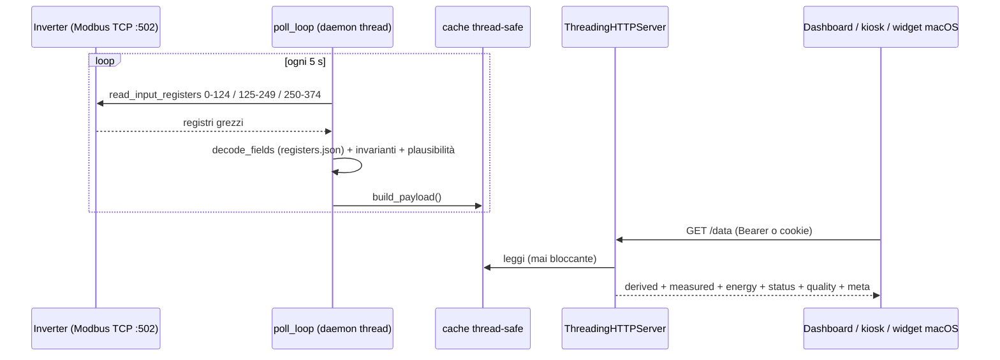

# SODE — EnergyFlow

> **Versione corrente: v2.0.0 — 2026-08-09**
>
> Stato del sistema: lettura Modbus TCP dell'inverter fotovoltaico di casa, API HTTP
> locale autenticata, dashboard web e pannello a muro in kiosk verticale.

Questo documento è la **fotografia dello stato** del progetto, non la sua cronologia:
la storia sta nei commit (regola #2.1).

---

## 1. Panoramica

EnergyFlow legge in tempo reale i registri dell'inverter ibrido di casa via **Modbus TCP**
(function code 4, input register), li decodifica con una mappa versionata e verificata,
e li pubblica su un'API HTTP locale che alimenta tre consumatori: la dashboard web,
il pannello a muro (kiosk verticale su Raspberry Pi) e i widget nativi macOS.

Il sistema non passa dal cloud del costruttore: legge il dispositivo sulla LAN, quindi
i dati arrivano con la latenza del poll (5 s) invece dei minuti del portale.

Cosa lo distingue dalla versione precedente, in una riga: la mappa registri non è più
un'ipotesi ma è **verificata contro il portale ufficiale con identità aritmetiche**, e
tutto ciò che non è stato verificato è dichiarato `unknown` invece di essere indovinato.

---

## 2. Attori e componenti

| Attore | Chi/cosa è | Cosa fa |
|---|---|---|
| **Inverter** | SolaX X1‑Hybrid G4 monofase (rebrand Q.CELLS Q.HOME ESS HYB‑G3) | Server Modbus TCP sulla LAN, porta 502 |
| **Poller** | thread daemon in `invert.py` | Legge i registri ogni 5 s, decodifica, valida, aggiorna la cache |
| **API** | `ThreadingHTTPServer` in `invert.py` | Serve la cache; non tocca mai il Modbus dentro una richiesta HTTP |
| **Dashboard** | `index.html` + `static/` | Vista compatta (desktop/mobile) e vista kiosk verticale |
| **Kiosk** | Raspberry Pi + labwc/Wayland + chromium | Pannello a muro 1080×1920, avvio automatico al boot |
| **Widget macOS** | `macos-widget/` (3 client) | `EnergyBar.swift`, `EnergyFlowWidget.swift`, `EnergyFlow.widget/index.jsx` |
| **Manutentore** | Ripu | Deploy, aggiornamento mappa, validazione |

### 2.1 Il dispositivo

Non è un inverter generico e non serve dedurlo: **lo dichiara da sé**. Gli holding
register 0‑20 rispondono in ASCII big‑endian e contengono numero di serie (0‑6),
costruttore `Solax` (7‑13) e modello `X1-Hybrid G4` (14‑20). Il Q.CELLS Q.HOME ESS
HYB‑G3 è un SolaX rimarchiato: il firmware si presenta come SolaX, quindi valgono le
mappe della famiglia X1 GEN4 e non quelle GEN5 o X3.

Gli holding 133‑138 sono l'orologio interno (sec, min, ora, giorno, mese, anno−2000):
lo scarto rispetto all'ora del server viene pubblicato come `meta.device.clock_skew_s`.

Il **numero di serie non è scritto in questo documento** (regola #16.8): è leggibile
dai registri e l'API lo pubblica **mascherato** (`meta.device.serial` +
`serial_masked: true`).

---

## 3. Architettura e flusso dati


```mermaid
sequenceDiagram
    participant INV as Inverter (Modbus TCP :502)
    participant POLL as poll_loop (daemon thread)
    participant CACHE as cache thread-safe
    participant API as ThreadingHTTPServer
    participant UI as Dashboard / kiosk / widget macOS

    loop ogni 5 s
        POLL->>INV: read_input_registers 0-124 / 125-249 / 250-374
        INV-->>POLL: registri grezzi
        POLL->>POLL: decode_fields (registers.json) + invarianti + plausibilità
        POLL->>CACHE: build_payload()
    end

    UI->>API: GET /data (Bearer o cookie)
    API->>CACHE: leggi (mai bloccante)
    API-->>UI: derived + measured + energy + status + quality + meta
```

Il polling è **disaccoppiato** dall'HTTP: `/data` serve solo la cache, con
`meta.age_s`, `meta.stale` e `meta.last_error`. Se l'inverter è lento o assente il
server continua a rispondere, dicendo che i dati sono vecchi invece di appendersi.

### 3.1 Auto‑discovery dell'inverter (self‑healing)

Dopo **5 poll falliti consecutivi** (~40 s) il poller esegue uno sweep della subnet /24
locale sulla porta 502 (ThreadPool, ~3 s), verifica i candidati con una **firma di
registri** (tensione di rete 180‑260 V su reg 0, SOC 0‑100 su reg 28) per escludere
altri dispositivi Modbus, aggiorna l'IP in memoria e **riscrive `config.json`**.
Massimo uno sweep ogni 60 s. Copre il caso del DHCP che riassegna l'indirizzo
dell'inverter: è una compensazione, non la soluzione (vedi §14.1).

---

## 4. Mappa registri — `registers.json` v2.1

- **69 campi** definiti, **48 pubblicati**, **21 marcati `unknown`** ed **esclusi
  dall'API**. Un registro non capito non viene indovinato: sparisce dal payload.
- **Spazio**: input register (function code 4). Blocchi di lettura: 0‑124, 125‑249, 250‑374.
- **Word order `low_first`**: per i 32 bit, `val = reg[n] + reg[n+1] * 65536`.
- Ogni campo porta `type` (`u16`/`s16`/`u32`/`s32`), `scale`, `unit`, `sign`,
  `confidence` (`high`/`medium`/`unknown`), `evidence` e `publish`.

### 4.1 Come è stata verificata

Confronto con il **portale ufficiale del costruttore** su 3 campioni Modbus accoppiati
agli stessi istanti (lag 0,1 s), più **due identità aritmetiche** che chiudono scale e
word order insieme — se una sola scala fosse sbagliata, l'identità non tornerebbe:

| Identità | Formula | Risultato | Portale |
|---|---|---|---|
| Giornaliera | `reg80/81 − reg152/153 + reg154/155 + reg144` | **21,4 kWh** | 21,4 kWh (esatto) |
| Totale | `reg82/83 − reg72/73 + reg74/75 + reg142/143` | **2773,00** | 2770,18 (0,1 %) |

Fonti incrociate: template `solax.yaml` di evcc, plugin `plugin_solax.py` di
`wills106/homeassistant-solax-modbus` (sezioni `AC|HYBRID|GEN4`), e le letture live
dell'impianto — riportate nel campo `evidence` di ciascun registro.

### 4.2 Data Dictionary (registri chiave)

| Reg | Campo | Tipo | Scala | Unità | Note |
|---|---|---|---|---|---|
| 0 | `inverter_voltage_v` | u16 | 0.1 | V | Tensione AC ai morsetti dell'inverter, **non** del contatore |
| 2 | `inverter_power_w` | **s16** | 1 | W | Potenza AC. **Con segno**: + uscita verso casa/rete, − assorbimento (carica da rete) |
| 7 | `grid_frequency_hz` | u16 | 0.01 | Hz | |
| 8 | `inverter_temp_c` | s16 | 1 | °C | Temperatura **inverter**, non batteria |
| 9 | `run_mode` | u16 | 1 | — | Etichette in `run_mode_labels` |
| 10 / 11 | `pv1_power_w` / `pv2_power_w` | u16 | 1 | W | **Potenza DC per stringa**: è da qui che nasce il solare, non da un giro algebrico |
| 20 | `battery_voltage_v` | u16 | 0.1 | V | Tensione del pacco |
| 22 | `battery_power_w` | **s16** | 1 | W | **+ = carica**, − = scarica |
| 28 | `battery_percent` | u16 | 1 | % | SOC |
| 70 / 71 | `grid_feedin_power_w` | **s32** | 1 | W | Potenza al contatore. **Grezzo: + = export**. L'API pubblica il segno opposto (§5) |
| 72 / 73 | `grid_export_total_kwh` | u32 | 0.01 | kWh | Monotono |
| 74 / 75 | `grid_import_total_kwh` | u32 | 0.01 | kWh | Monotono |
| 80 / 81 | `yield_today_kwh` | u32 | 0.1 | kWh | **Resa AC giornaliera** (azzerata a mezzanotte) |
| 82 / 83 | `yield_total_kwh` | u32 | 0.1 | kWh | Monotono |
| 148 / 149 | `solar_total_kwh` | u32 | 0.1 | kWh | Energia DC totale dai pannelli |
| 150 / 151 | `solar_today_kwh` | u32 | 0.1 | kWh | Energia DC giornaliera dai pannelli |
| 152 / 154 | `grid_export_today_kwh` / `grid_import_today_kwh` | u32 | 0.01 | kWh | |
| 186 / 187 | `battery_temp_high_c` / `battery_temp_low_c` | s16 | 0.1 | °C | Temperature **cella** max/min |
| 191 | `battery_soh_pct` | u16 | 1 | % | Stato di salute |

La mappa completa (69 campi, con `evidence` per ciascuno) è in `registers.json`.

### 4.3 Registri da NON usare su questo modello

Sono mappati altrove ma su questo impianto leggono **sempre zero**; nella mappa sono
marcati `unknown` con prefisso `_unavailable_` e non escono dall'API:

| Reg | Cosa sarebbe | Perché è escluso |
|---|---|---|
| 50 | potenza PV totale | sempre 0 |
| 52 | potenza AC on‑grid totale | sempre 0 |
| 58 | — | sempre 0 |
| 200 / 201 / 205 | frequenza, tensioni e correnti di fase lato **contatore** | l'intero blocco 200‑208 legge zero: il contatore collegato non le espone via questo canale |

Il solare si prende da 10/11, la tensione da 0, il flusso di rete da 70/71.

---

## 5. Convenzione dei segni — decision record

> Questa sezione è la **traduzione** delle 28 righe di ragionamento che stavano
> commentate in `invert.py`. Non sono state cancellate: sono state chiuse e portate qui
> (regola #19 — il codice commentato si traduce, non si butta).

Il registro **70/71** (int32, word order low‑first) è la potenza misurata al contatore,
**positivo in immissione** (export) e negativo in prelievo: verificato dal vivo il
2026‑08‑09 alle 18:33:50, quando con PV a 1020 W, inverter a 1092 W AC e batteria in
scarica a 126 W, la casa assorbiva 1149 W e il registro valeva **−57** — i 57 W che
arrivavano dalla rete. Coerente con evcc, che legge lo stesso indirizzo con `scale: -1`
perché la sua convenzione è l'opposta.

L'**API pubblica adotta la convenzione opposta a quella del registro**:
`derived.grid_flow_w` è **positivo in prelievo** (import). Quindi:

```
grid_flow_w = −int32(reg 70, reg 71)
```

Non è una scelta estetica: i client Swift in `macos-widget/` scrivono «Import» quando
il valore è positivo, e la formula del carico di casa è `home = inverter_ac + grid_flow`.

Il registro **22** (batteria) è **positivo in carica**, negativo in scarica: stessa
convenzione nel registro e nell'API.

Il **carico di casa non ha un registro dedicato**:

```
home = inverter_ac(reg 2, CON segno) + grid_flow_w
```

Il segno di reg 2 è essenziale e **non va sostituito dal modulo**: di notte, caricando
la batteria dalla rete, l'inverter assorbe potenza AC e reg 2 è negativo — usare `abs()`
gonfierebbe il carico di casa del doppio della potenza di carica. Il portale ufficiale
calcola invece `PV − rete`, che ignora il ~5 % di perdite di conversione: la formula con
reg 2 è più corretta.

`derived.inverter_power_w` resta il **modulo**, per contratto con i client esistenti; il
valore firmato è disponibile in `measured.inverter_power_signed_w`.

**Come ci si è arrivati.** La versione precedente conteneva ventotto righe di
ragionamento commentato che oscillava fra le due convenzioni senza chiudere, più una
variabile calcolata invertendo il segno e mai usata. Il dubbio nasceva dal fatto che il
registro allora letto — il **reg 80** — non era affatto il flusso di rete ma la
produzione AC del giorno in kWh. La contraddizione non era nel segno: era nel registro.

---

## 6. Contratto API

Base: `http://127.0.0.1:8003/` (porta da `config.json` → `server.port`).

### 6.1 Endpoint

| Metodo | Path | Auth | Cosa fa |
|---|---|---|---|
| GET | `/health` | **no** (unica eccezione, regola #17) | Sonda: freschezza, invarianti persistenti falliti, warning. `200` se ok, **`503` se `degraded`** |
| GET | `/data` | sì | Payload completo dalla cache |
| GET | `/api/ui-config` | sì | Solo parametri di dimensionamento (capacità batteria, `min_soc`, kWp, intervallo di poll). **Niente coordinate, niente inverter** |
| GET | `/api/weather` | sì | Proxy server‑side verso open‑meteo, cache 15 min |
| POST | `/log` | sì | Relay dei log del browser nel file giornaliero (regola #7) |
| GET | statici | — | `index.html`, icone, manifest, `static/**` da allow‑list (§8) |

`index.html` è servito senza token ed è il punto in cui il token **viene consegnato** al
browser come cookie `HttpOnly` (§8): tutto ciò che contiene dati richiede comunque auth.

### 6.2 Forma di `/data`

```jsonc
{
  "raw":      { "0": 2470, "...": 0 },        // registri grezzi, per il pannello tecnico
  "derived":  { /* contratto pubblico, vedi 6.3 */ },
  "measured": { /* SOLO valori letti da registro, mai calcolati */ },
  "energy":   { "today": { ... }, "total": { ... } },
  "status":   { "battery": "charging|discharging|idle",
                "grid":    "importing|exporting|balanced",
                "system":  "Normal | TOU Self Use | ..." },
  "quality":  { "<campo>": "measured|derived|unavailable|suspect" },
  "meta":     { "port": 502, "source": "...", "count": 375,
                "blocks_failed": [], "map_version": "2.1",
                "device": { "model": "...", "serial": "···mascherato···",
                            "serial_masked": true, "clock_skew_s": 0 },
                "validation": { "invariants_failed": [],
                                "invariants_failed_persistent": [],
                                "warnings": [] },
                "timestamp": 0, "age_s": 0.4, "stale": false, "last_error": null }
}
```

`meta` **non contiene più `ip`**: nessun client lo usava e la telemetria di casa non
deve portarsi dietro l'indirizzo di un dispositivo sulla LAN (regola #16.8).

### 6.3 Vincolo di compatibilità — il contratto che non si tocca

Questi sei campi **non cambiano mai nome, tipo e segno**:

```
derived.solar_power_w      derived.home_load_w
derived.battery_percent    derived.inverter_power_w     (modulo)
derived.grid_flow_w        derived.battery_power_w      (+ = carica)
        (+ = import)
```

Motivo operativo: i tre client in `macos-widget/` li decodificano come campi
**non‑opzionali**; un `null` fa fallire l'intero decode **in silenzio**, e il widget
smette semplicemente di aggiornarsi senza dire perché.

- **Aggiungere** campi è sicuro: Swift ignora le chiavi sconosciute.
- **Rinominare o rimuovere** no.

Sempre in `derived`, ora finalmente corretti: `daily_energy_kwh` (è davvero l'energia
del giorno, da reg 150/151) e `battery_voltage_v` (è davvero una tensione, da reg 20).

---

## 7. Logica di calcolo

| Grandezza | Origine |
|---|---|
| `solar_power_w` | `pv1_power_w + pv2_power_w` (reg 10 + 11), **misurata**, non derivata |
| `grid_flow_w` | `−int32(70,71)` — vedi §5 |
| `home_load_w` | `inverter_ac_con_segno + grid_flow_w`, con clamp a 0 |
| `inverter_power_w` | `abs(reg 2)` per contratto; il firmato è in `measured.inverter_power_signed_w` |
| `battery_power_w`, `battery_percent` | reg 22, reg 28, diretti |
| `status.battery` / `status.grid` | deadband ±20 W per non far lampeggiare le etichette |

**Niente formule tautologiche.** Il solare non è più ricavato da un bilancio algebrico
che si semplificava in `|inverter| + batteria`: quella forma tornava con qualunque mappa,
anche sbagliata, e per questo non poteva accorgersi di un errore.

**Comportamento notturno.** Non esiste più una soglia che forza il solare a 0 sotto un
certo valore: leggendo le potenze DC di stringa (reg 10/11) di notte il valore è già
zero per costruzione. Il controllo è passato dal *correggere* al *verificare*:
l'invariante **I9** («di notte pv ≈ 0», finestra 23:00‑04:00, soglia 20 W) fallisce se
un registro racconta produzione notturna, invece di nasconderlo azzerandolo.

---

## 8. Sicurezza

| Misura | Stato |
|---|---|
| **Bind** | `127.0.0.1` di default. `--host 0.0.0.0` esiste ma l'help avverte che espone la telemetria a tutta la LAN. Kiosk e `tailscale serve` usano già il loopback |
| **Token** | Generato con `secrets.token_urlsafe(32)` al primo avvio e scritto in `.env` con **perm 600** via `os.open(..., 0o600)` — il file non esiste mai, nemmeno per un istante, con permessi più larghi. Mai committato |
| **Trasporto del token** | Header `Authorization: Bearer <t>` (widget, CLI) **oppure** cookie `ef_token` con `Path=/; HttpOnly; SameSite=Strict`. `HttpOnly` = non leggibile da JS; niente `Secure` perché il kiosk carica `http://localhost` in chiaro e il traffico non lascia il loopback |
| **Confronto** | `hmac.compare_digest` a tempo costante |
| **Statici** | **Allow‑list esplicita**: chiavi letterali per i file di root + cartella `static/` ammessa per costruzione (prefisso `static/`, estensione in whitelist, **`realpath` confinato** con separatore in coda, solo file regolari). Prima era servibile *qualsiasi* file della cartella: `config.json` con le coordinate di casa, `.git/`, `registers.json`, i log |
| **CORS** | Nessun `Access-Control-Allow-Origin`. Con `*` qualunque sito aperto in un browser della LAN poteva leggere la telemetria di casa |
| **`POST /log`** | Auth **prima** di leggere il body; cap **4 KB**; `Content-Length` non numerico → 400 invece di traceback; escape di `\r`/`\n`/`\\` contro la log injection |
| **Header** | `X-Content-Type-Options: nosniff`, `X-Frame-Options: DENY`, `Referrer-Policy: no-referrer`, `Content-Security-Policy` su **ogni** risposta, errori e 404 compresi |
| **CSP** | `default-src 'self'; script-src 'self'; style-src 'self'; font-src 'self'; img-src 'self' data:; connect-src 'self'; base-uri 'self'; form-action 'none'; object-src 'none'; frame-ancestors 'none'` — **zero CDN, zero inline** |
| **Coordinate di casa** | Restano sul Raspberry: il meteo passa da `/api/weather`, il browser non chiama più open‑meteo |
| **Seriale inverter** | Mascherato nell'API |
| **401** | Loggati con IP e path (regola #17), per vedere gli scan prima che diventino un problema |
| **systemd** | `NoNewPrivileges`, `PrivateTmp`, `ProtectSystem=full`, `ProtectKernelTunables`, `ProtectControlGroups`, `RestrictSUIDSGID` |

**Recuperare il token** (serve a configurare i client non‑browser):

```bash
python3 invert.py --print-token     # stampa su stdout ed esce; NON finisce nel log
```

I widget macOS lo leggono da `$ENERGYFLOW_TOKEN` o da `~/.config/energyflow/token`.

---

## 9. Validazione e watchdog

### 9.1 `--validate` — 12 invarianti fisici

```bash
python3 invert.py --validate --duration 600 --interval 5   # campiona dal vivo
python3 invert.py --capture campioni.ndjson --duration 600 # registra
python3 invert.py --validate --from campioni.ndjson        # rivaluta offline
```

| ID | Invariante |
|---|---|
| I1 | `home = inverter_ac + grid_flow` (bilancio) |
| I2 | rendimento `ac / (pv − batt)` dentro banda |
| I3 | `V × I ≈ P` sulle coppie (0,1,2), (3,5,10), (4,6,11) |
| I4 | rendimento giornaliero AC/DC |
| I5 | tensione pacco / tensione cella ≈ numero intero di celle |
| I6 | `∫ pv·dt ≈ Δ` contatore giornaliero (integrale potenza vs contatore) |
| I7 | contatori totali monotoni non decrescenti |
| I8 | contatori giornalieri azzerati a mezzanotte |
| I9 | di notte `pv ≈ 0` |
| I10 | SOC 100 % + surplus ⇒ batteria ferma ed export |
| I11 | consumo di casa **di oggi** dai contatori (identità giornaliera del portale) |
| I12 | consumo di casa **totale** dai contatori (identità totale del portale) |

Esito `pass` / `skip` / `fail`; **exit code 1** se almeno un invariante fallisce.

**Prova che non è tautologico**: iniettando `scale: 10` su `pv1_power_w`, gli invarianti
**I2, I3 e I6 vanno FAIL** con `EXIT=1`. Una batteria di controlli che passa con qualunque
mappa non sta controllando niente.

### 9.2 Watchdog permanente

Gli invarianti puntuali girano **ad ogni poll**, non solo su richiesta — è ciò che rende
`/health` una sonda vera e non un ping al processo.

- Valore fuori dal **dominio fisico** (`plausibility` in `registers.json`) →
  `quality: "suspect"` sul campo + `/health` a `degraded` (**503**) **entro un poll**.
- Contatore totale che **diminuisce** senza essere vicino al rollover a 32 bit →
  `suspect`: o l'inverter è stato sostituito, o si sta leggendo il registro sbagliato.
- Per gli **invarianti** servono **2 poll consecutivi** falliti prima di degradare
  (`invariants_failed_persistent`): un singolo campione fuori banda non deve far
  lampeggiare rosso il pannello ad ogni rampa serale della batteria. Il fallimento
  transitorio si vede comunque, ma fra le `notes` di `/health`.

---

## 10. Frontend

### 10.1 Struttura

Da **1 file di 2572 righe** a **11 file**: `index.html` (344 righe) + `static/`
(`tokens.css`, `base.css`, `layout.css`, `components.css`, `kiosk.css`, `format.js`,
`charts.js`, `flow.js`, `keys.js`, `app.js`) + `logger.js`.

**Nessun build step e nessun modulo ES**: `<script defer>` si comporta identico da
`file://` e dal server, mentre i moduli ES da `file://` sono bloccati dalla CORS.
L'ordine conta: `format.js` definisce il bus `window.EF`, gli altri lo popolano,
`app.js` parte per ultimo.

Font **Sora self‑hostato** (`static/fonts/sora-latin-var.woff2`, ~25 KB, un solo file
variabile che copre tutti i pesi): niente Google Fonts, e quindi niente CDN nella CSP.

**Vista 3D Three.js rimossa.** Costava 600 KB scaricati da un CDN — che falliva offline
e sarebbe stato il vettore peggiore in caso di compromissione —, il loop di render non
veniva mai fermato al ritorno in 2D, e la logica dei flussi era duplicata e divergente
rispetto alla vista 2D.

### 10.2 Tema

Adattivo **giorno/notte**, agganciato agli orari reali di alba e tramonto: un pannello
bianco a muro, di notte, in salotto, è una lampada. Il tasto `t` cicla
`auto → chiaro → scuro → auto` e l'override è persistito in `localStorage`; il ritorno
ad "auto" nel ciclo è deliberato, altrimenti un override notturno resterebbe incollato
per sempre.

**Contrasti AAA verificati per calcolo**, non a occhio: testo **15,48:1** su fondo chiaro
e **12,62:1** su fondo scuro; testo attenuato **7,24** e **7,76**. Il target è AAA (7:1) e
non AA perché il pannello si legge da tre metri, con il riflesso del vetro.

### 10.3 Diagramma di flusso

Le coordinate sono **misurate** con `getBoundingClientRect()` sui dischi dei nodi, e il
`viewBox` segue i pixel CSS reali del contenitore 1:1 tramite `ResizeObserver`:
**zero costanti geometriche nel markup**.

Prima erano 4 curve di Bézier scritte a mano dentro un `viewBox` fisso con
`preserveAspectRatio="none"`: bastava un rapporto d'aspetto diverso da quello previsto
perché gli archi si staccassero dai nodi.

### 10.4 Due layout da un solo markup

Lo stesso HTML rende sia il **kiosk verticale 1080×1920** sia la vista
**mobile/desktop**. Selezione: `?mode=kiosk` / `?mode=compact` → `localStorage` →
media query. Gli elementi non pertinenti al kiosk sono marcati `data-kiosk-hidden`.

### 10.5 Stati

| Stato | Cosa mostra | Perché |
|---|---|---|
| **loading** | scheletri (`--`), **nessun numero** | Prima la pagina partiva con `sampleRaw`: numeri inventati che sembravano veri |
| **warn / stale** | banner ⏳, valori barrati come vecchi | Il **backend risponde** ma i dati del poller sono fermi (Modbus giù) |
| **offline** | riquadro rosso «BACKEND OFFLINE», valori rimossi | Il **backend non risponde a noi**. È un guasto diverso dallo stale e va distinto, altrimenti si cerca il problema dalla parte sbagliata |
| **suspect** | campo barrato | Il watchdog lo ha marcato fuori dal dominio fisico |

Accessibilità: `skip-link`, una sola regione `aria-live="polite"` riscritta ogni 30 s
(i valori veri cambiano ogni 5 s e un lettore di schermo non smetterebbe mai di parlare),
banner di guasto in `aria-live="assertive"`, equivalente testuale tabellare del
diagramma, `prefers-reduced-motion` rispettato senza perdere l'informazione di direzione.

### 10.6 Vista 3D (`static/view3d.js`)

Rappresentazione tridimensionale dell'impianto, si apre col tasto `3` o dal bottone
nei controlli. Era stata rimossa e poi **ripristinata su richiesta**: le tre ragioni
per cui era stata tolta sono state risolte, non aggirate.

| Difetto di prima | Come è risolto ora |
|---|---|
| three.js scaricata da un CDN (unpkg): falliva senza internet e impediva una CSP stretta | **Vendorizzata** in `static/vendor/three.min.js`, servita da noi |
| Il ciclo di render non si fermava mai tornando in 2D | Si ferma davvero — verificato contando i **fotogrammi disegnati** |
| Logica dei flussi duplicata e divergente (deduceva la batteria da euristiche giorno/notte) | `static/flow.js` espone `EF.flow.resolve()`: **una sola semantica** per 2D e 3D, e la 3D si iscrive all'evento `flow` |

- **Dipendenza vendorizzata**: three.js **r159**, build **UMD** minificata, 668 024 byte,
  sha256 `7b1c5d75…28a585` (l'hash è ripetuto in testa a `view3d.js`). r159 è l'ultima
  revisione con build UMD: uno `<script>` classico evita gli ESM, che da `file://` il
  browser blocca. Il file è tenuto **identico all'originale** perché l'hash resti
  verificabile — anche a costo del suo avviso di deprecazione in console.
- **Caricamento pigro**: lo script viene iniettato alla **prima apertura**, non
  all'avvio. Chi non apre mai la 3D non scarica 668 kB né crea un contesto WebGL.
- **Il ciclo si ferma** all'uscita, quando la pagina non è visibile
  (`visibilitychange`) e quando la finestra perde il focus; riparte al focus. Con
  `prefers-reduced-motion` la scena viene disegnata una volta e le particelle sono
  sostituite da frecce statiche. Il contatore è ispezionabile con `EF.view3d.stats()`
  e a schermo con `?debug3d=1`.
- **Esclusa dal kiosk**, con tre reti indipendenti (bottone in una sezione
  `data-kiosk-hidden`, rifiuto in `doOpen()`, regola in `kiosk.css`): il pannello a muro
  non ha mouse né tastiera, quindi nessuno può orbitare, e la 3D non aggiungerebbe
  nulla ai numeri già grandi della 2D — in cambio di un contesto WebGL acceso h24.
- **Limite noto**: alla chiusura il renderer non viene distrutto. Il ciclo è fermo e
  non consuma cicli, ma il contesto WebGL resta in memoria finché la scheda è aperta,
  in cambio di una riapertura immediata.

---

## 11. Scorciatoie da tastiera (regola #5)

Prima non ne esisteva nessuna: la dashboard si guidava solo col mouse.

| Tasto | Azione |
|---|---|
| `?` | Apre e chiude l'aiuto |
| `r` | Aggiorna i dati adesso |
| `a` | Aggiornamento automatico on/off |
| `t` | Tema: automatico → chiaro → scuro → automatico |
| `k` | Modalità kiosk / compatta |
| `1` | Vista flusso |
| `2` | Vista storico |
| `3` | Vista 3D (apre e chiude) |
| `d` | Pannello registri |
| `f` | Schermo intero |
| `Esc` | Chiude l'overlay |

Due comportamenti non ovvi: i tasti sono **inerti mentre si scrive** in un
`input`/`textarea`/`select` o in un elemento `contenteditable` (altrimenti digitare
"attivo" spegnerebbe l'auto‑refresh e cambierebbe tema), e con l'aiuto aperto l'unica
uscita è `Esc` o `?` — gli altri comandi non passano, per non cambiare la pagina sotto
un pannello modale. Il focus torna sull'elemento di partenza alla chiusura.

Il riquadro «Scorciatoie» in‑app (bottone o `?`) elenca le stesse voci.

---

## 12. Convenzioni UX/UI (regola #22)

La vista a flusso è il contenitore `position: relative` e ospita **sei slot overlay**:

```
top-left      top-center      top-right
bottom-left   bottom-center   bottom-right
```

- Ogni slot è un contenitore flex: due elementi nello stesso slot **si impilano**, non si
  coprono.
- `pointer-events: none` sul contenitore, `auto` sui figli: uno slot vuoto non blocca le
  interazioni sottostanti.
- **Nessun elemento si posiziona con `top`/`left` assoluti «a occhio»**, e non si alza
  lo `z-index` per risolvere una sovrapposizione: si sposta l'elemento nello slot giusto.

Occupazione attuale: `top-center` = banner *stale* ed *errore* (impilati);
`bottom-left` = legenda dei flussi; gli altri quattro sono liberi.

Verifica ai viewport **360 / 768 / 1440** più il **1080×1920 verticale** del kiosk, in
entrambi i temi.

---

## 13. Prerequisiti, configurazione, porte

### 13.1 Prerequisiti

- **Python 3.9+**
- **`pymodbus`** — il nome del parametro dello slave è cambiato tre volte
  (`unit` → `slave` → `device_id`). `invert.py` prova `device_id` (v3.11+), poi `slave`
  (v3.8), poi `unit`, e **memorizza quello che funziona**: gira su entrambe le versioni
  senza pin e senza `if` sulla versione.
- **Swift** solo per ricompilare i widget macOS.

### 13.2 `config.json` (non committato — `config.example.json` è il modello)

```jsonc
{
  "location": { "latitude": 0.0, "longitude": 0.0, "timezone": "Europe/Rome" },
  "inverter": { "ip": "<ip-inverter-lan>", "port": 502 },
  "battery":  { "capacity_kwh": 0.0, "min_soc": 0 },
  "server":   { "port": 8003 }
}
```

Le coordinate reali dell'impianto **non compaiono in questo documento né nel repo**
(regola #16.8): stanno solo nel `config.json` della macchina.

### 13.3 Porta (regola #6)

Porta di progetto **8003**, con **unica fonte di verità**:

```
--port esplicito  →  config.json server.port  →  8003 (default)
```

Se la porta è occupata **il server non parte**: logga l'errore e **nomina il processo
occupante** (via `lsof`, con fallback `ss`). L'auto‑incremento silenzioso è stato
rimosso — il kiosk punta a 8003 hardcoded, quindi un server salito da solo su 8004
lasciava il pannello a muro bianco senza un singolo segnale d'errore.

### 13.4 Log (regole #7 e #10)

- File giornalieri in `log/YYYY-MM-DD.txt`, accanto a questo SODE. La cartella `log/`
  è gitignorata: i log restano sulla macchina.
- I log del **browser** arrivano allo stesso file via `POST /log` con prefisso
  `[BROWSER:LEVEL]`, così sono leggibili senza accedere alla console del kiosk.
- Ogni poll logga il **timing in ms** più i valori sintetici; sul servizio
  `PYTHONUNBUFFERED=1` li rende visibili in `journalctl` senza ritardo di buffering.

### 13.5 Storico persistente

Il grafico dell'andamento non vive più solo nel browser: sopravvive al riavvio del Pi.
Tre livelli, dimensionati per **non consumare la microSD** — il vincolo che governa
questa parte, perché il poller gira ogni 5 s e appenderci sopra farebbe ~17.000
scritture al giorno.

| Livello | Dove | Scritture |
|---|---|---|
| Anello 60 min a 5 s (720 punti) | RAM | **nessuna** |
| Dettaglio al minuto | `log/energy/YYYY-MM-DD.csv` | 1 append/minuto, senza `fsync` |
| Rollup giornaliero | `log/energy/daily.csv` | 1 riga/giorno, conservata per sempre |

Il punto al minuto è la **media dei 12 campioni** di quel minuto, non un'istantanea.
Misurato sul campo: 29,9 byte/riga → **42 kB per un giorno pieno**, 3,69 MB al tetto
della retention, contro 12 volte più scritture di un append per poll.

- **Rollup alle 00:05**, in un thread dedicato, con **catch-up all'avvio**: se il Pi era
  spento a quell'ora il giorno viene consolidato al primo avvio utile invece di sparire
  quando scatta la retention.
- **Retention 90 giorni** sui file al minuto; `daily.csv` non si cancella mai. La
  pulizia non tocca nulla che non sia già consolidato e **logga ogni cancellazione**
  con nome e peso: nessun taglio silenzioso.
- **Dedup in lettura** (vince l'ultima riga del minuto): due processi che scrivono la
  stessa cartella — succede davvero durante le prove — duplicherebbero i minuti e
  farebbero contare l'energia due volte nel rollup.
- **Interruttore**: `history.enabled` in `config.json` (default `true`), con
  `history.retention_days`. A `false` non si scrive nulla, gli endpoint danno 404 e la
  sezione Storico della dashboard sparisce da sola.
- Endpoint: `GET /history/day/YYYY-MM-DD` (oltre ~288 punti la risposta è
  ridimensionata e **dichiara** `downsample_factor` e `resolution_s`),
  `GET /history/range/<da>/<a>` (aggregati, massimo 366 giorni),
  `GET /history/live` (anello RAM, zero I/O). La data non arriva mai al filesystem come
  stringa: il path si ricostruisce da un oggetto `date` riparsato.
- **Limite dichiarato**: in `daily.csv` solo `pv_kwh` viene dal contatore
  dell'inverter ed è esatto; import, export, carica e scarica sono **integrati** dalle
  medie al minuto, perché alle 00:05 i contatori giornalieri del dispositivo si sono
  già azzerati. `peak_pv_w` è il minuto più forte, non il picco istantaneo.

---

## 14. Deployment

**Target**: Raspberry Pi, alias SSH `<rpi-host>` (l'indirizzo reale non compare nel
repo — regola #16.8).

- **Percorso**: `/home/<utente>/EnergyFlow`
- **Virtualenv**: `/home/<utente>/EnergyFlow/venv` — il service lancia
  `venv/bin/python3`, non il Python di sistema
- **Unit**: `energyflow.service` (`Restart=always`, **abilitato al boot** con
  `systemctl enable`), `EnvironmentFile=-.../.env` (il `-` rende il file opzionale: al
  primo avvio non esiste ancora e `invert.py` lo genera)
- **Nessun `--port` e nessun `--host` nella unit**: i default sono già quelli giusti e
  duplicarli significava tenerli allineati a mano in tre posti

### 14.1 Procedura di rilascio (quella reale)

Il deploy è **diretto sul Raspberry, senza passare da GitHub**:

```bash
scp invert.py registers.json index.html <rpi-host>:/home/<utente>/EnergyFlow/
scp -r static/ <rpi-host>:/home/<utente>/EnergyFlow/static/
ssh <rpi-host> "sudo systemctl restart energyflow && systemctl status energyflow"
curl -s http://127.0.0.1:8003/health     # sul Pi: deve dare 200 e status ok
```

Il push su GitHub resta il canale di **tracciabilità** (regola #1) ma non è il canale di
distribuzione: il Pi non fa `git pull`.

**Regola d'oro dopo ogni rilascio**: `/health` deve tornare `200` con `status: "ok"`.
Un `503 degraded` subito dopo un deploy è quasi sempre una mappa registri disallineata.

### 14.2 Manutenzione aperta

- **⚠️ DHCP reservation ancora da fare.** Sul router va impostata una prenotazione DHCP
  per il MAC dell'inverter (il MAC non si scrive qui — regola #16.8). L'auto‑discovery
  (§3.1) **compensa** il cambio di indirizzo ma non lo risolve: fino ad allora, ad ogni
  rinnovo del lease il sistema resta cieco per una quarantina di secondi prima di
  ritrovarsi da solo.
- Alla sostituzione dell'inverter: rieseguire `--validate` prima di fidarsi dei numeri
  (I7 segnalerà i contatori che sono tornati indietro).

---

## 15. Go‑live (regola #16.7)

| Voce | Valore |
|---|---|
| **Esposizione** | **Nessuna porta aperta su internet.** Il server binda `127.0.0.1` |
| **Accesso LAN** | **Nessuno.** Il server binda `127.0.0.1`, quindi dalla rete di casa — telefono compreso — la dashboard **non è raggiungibile**: si passa dal tailnet. Scelta confermata dall'utente il 2026‑08‑09: riaprire alla LAN esporrebbe la telemetria di casa a ospiti e dispositivi IoT sulla stessa rete, e il perimetro domestico non è un confine di fiducia. Sul Pi la pagina resta su `http://localhost:8003/`, che è ciò che usa il kiosk |
| **Accesso remoto** | Tailnet HTTPS via `tailscale serve --bg http://127.0.0.1:8003` → certificato Let's Encrypt gestito da Tailscale, **tailnet‑only**. Disattivazione: `sudo tailscale serve --https=443 off` |
| **Stato del tailnet** | **Operativo dal 2026‑08‑09.** Il nodo del Pi era finito `Logged out` e nessuno se n'era accorto finché il bind su loopback non ha reso la dashboard irraggiungibile: le due cose insieme la spengono, e vanno controllate insieme. `tailscale serve` è attivo e inoltra `/` verso `127.0.0.1:8003`, tailnet‑only. Verifica: `sudo tailscale status` (il nodo deve comparire) e `sudo tailscale serve status` |
| **Via di riserva** | Se il tailnet non è disponibile, tunnel SSH: `ssh -f -N -L 8003:127.0.0.1:8003 <rpi-host>` → `http://localhost:8003/`. Funziona da qualunque macchina che abbia già accesso SSH al Pi, senza toccare la configurazione |
| **Prerequisito** | Client Tailscale connesso sulla macchina che accede. mDNS `.local` **non** passa sul tailnet: da remoto si usa l'hostname del tailnet |
| **DNS pubblico** | Nessuno. Il progetto non ha un sottodominio `archimede.world`: è un sistema domestico, l'esposizione pubblica sarebbe un rischio senza contropartita |
| **Porta** | 8003 (§13.3) |
| **Indicizzazione** | `<meta name="robots" content="noindex,nofollow">` |
| **Icone e manifest** | `favicon.ico`, `favicon.svg`, `apple-touch-icon.png`, `icon-192.png`, `icon-512.png`, `site.webmanifest`, tutti in allow‑list statica |
| **Data go‑live** | Kiosk operativo dal 2026‑05‑31; revisione profonda 2026‑08‑09 (v2.0.0) |
| **Credenziali** | Nessuna in repo. Token in `.env` (perm 600) sul solo Pi — vedi password manager |

### 15.1 Kiosk (pannello a muro)

- **Compositor**: labwc (Wayland) sotto lightdm, autologin dell'utente di sistema.
- **Monitor**: output `HDMI-A-1`, pannello 1920×1080 **ruotato 270°** → 1080×1920
  verticale.
- **Autostart**: `~/.config/labwc/autostart`, copia tracciata in `deploy/labwc-autostart`:
  1. rotazione a 270° **con attesa e verifica** dell'uscita HDMI
  2. `chromium --kiosk --password-store=basic --app=http://localhost:8003/`
- **La rotazione va attesa, non lanciata e basta.** La versione precedente eseguiva
  `wlr-randr` subito all'avvio della sessione: l'uscita HDMI spesso non è ancora
  pronta, il comando fallisce **in silenzio** e il pannello resta orizzontale. Scoperto
  il 2026‑08‑09 trovando l'autostart che diceva 270 e il monitor su `normal`. Ora
  l'autostart aspetta che l'uscita compaia, applica la trasformazione e **rilegge** per
  confermare, riprovando fino a 30 secondi.
- **Perché 270 e non 90**: dipende da come il monitor è appeso, non dal software. A 90°
  l'immagine esce capovolta su questo montaggio — provato. Va verificato guardando il
  pannello, non dedotto.
- **Chromium impiega più di 30 secondi** a comparire dopo un `restart lightdm`: un
  controllo troppo precoce fa credere che il kiosk non sia partito.
- **`--password-store=basic` è obbligatorio**: senza, chromium chiede «Choose password
  for new keyring» (gnome‑keyring) e la pagina non si apre mai.
- L'URL del kiosk è **locale**: il pannello non dipende da rete o tailnet per accendersi.
- Applicare modifiche all'autostart senza reboot: `sudo systemctl restart lightdm`
  (riavvia la sessione labwc; il service `energyflow` resta su). Un chromium lanciato
  detached via SSH **non** sopravvive alla sessione: va usato l'autostart.
- Rotazione live: `wlr-randr --output HDMI-A-1 --transform <0|90|180|270>` con
  `XDG_RUNTIME_DIR=/run/user/<uid>` e `WAYLAND_DISPLAY=wayland-0`.

---

## 16. Repository e documentazione

- **Repo**: pubblico. Vale il vincolo #16.8 su ogni file committato: nessun IP, MAC,
  coordinata GPS, seriale, hostname operativo, token o credenziale.
- **Non committati**: `config.json`, `.env`, `log/`, `.antigravity.yml`,
  `macos-widget/EnergyBar.app/` (nel repo sta il sorgente Swift, non il binario non
  firmato), `screenshot_latest.png` (rendeva leggibili le coordinate di casa).
- **Branch**: `main`.
- **Versione** (regola #3): riga in testa a questo file. `X` per cambi radicali, `Y` ad
  ogni push, `Z` ad ogni commit locale.
- **Pacchetto di consegna** (regola #31): `SODE.md`, `README.md` (IT) + `README.en.md`
  (EN), `cover.svg` / `cover.png` in root, screenshot reali in `docs/screenshots/`,
  guida operativa e presentazione in `docs/guide/` e `docs/slides/`.
- **Shortcut: questo progetto non è tracciato** (decisione di Ripu, 2026-08-09). La
  regola #14 vuole il tag `[sc-XXXXX]` in ogni commit e prescrive di chiedere quando
  il numero non è noto: è stato chiesto, e la risposta è che qui Shortcut non si usa.
  I commit di questo repo quindi **non portano il tag** e non generano commenti sulle
  story. Non è una dimenticanza: è una scelta, annotata qui perché un audit futuro non
  la scambi per una violazione. Il *formato* del messaggio di commit (regola #19,
  richiesta utente + implementazione) resta valido.
